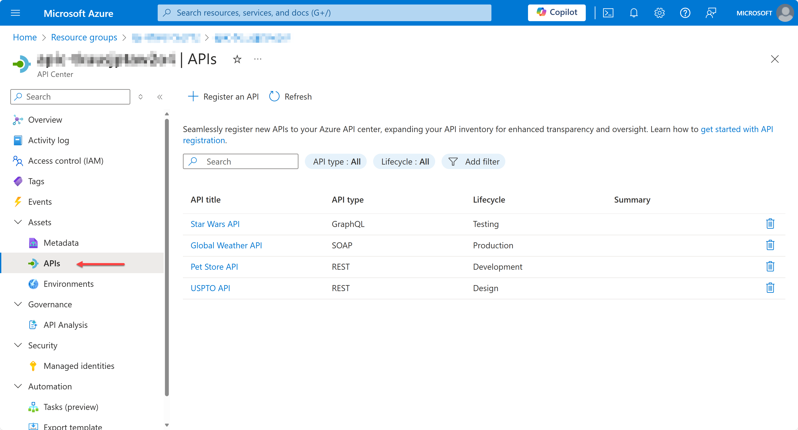
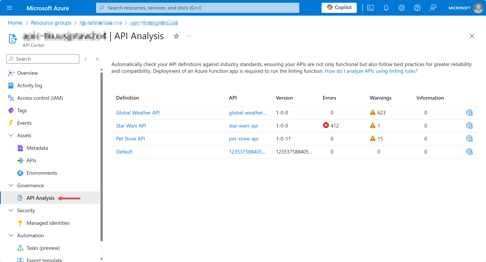
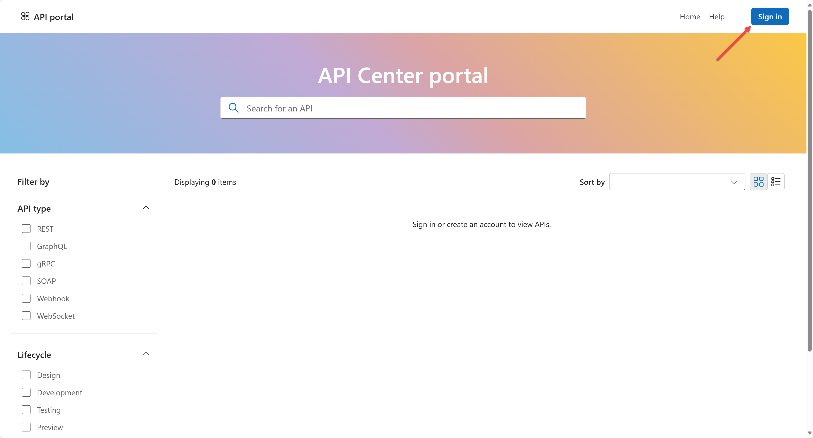
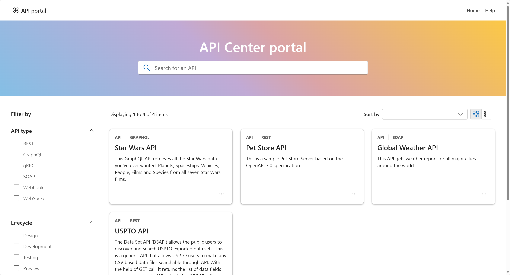

# API Center Reference

Throughout this reference sample, we'd like to give developer experiences how to use API Center (APIC) and seamless integration with API Management (APIM), as well as inner-loop development velocity increase.

- API Inventory
  - To Showcase API Management integration to quickly build API inventory from many API Management instances
  - To register APIs manually or through GitHub Actions workflow
- API Governance
  - To perform shift-left API governance functionality in VS Code
  - To run APIC Analyzer for server-side linting
  - To manage custom metadata
  - To handle events through Azure Event Grid and Logic Apps
- API Discovery and Consumption
  - To integrate the client SDK in .NET & JavaScript
  - To prepare the server app scaffolding in .NET and JavaScript
  - To manage API Center OSS portal

## Prerequisites

- [Azure Subscription](https://azure.microsoft.com/free/?WT.mc_id=dotnet-134184-juyoo)
- [Visual Studio Code](https://code.visualstudio.com/) with [API Center extension](https://marketplace.visualstudio.com/items?itemName=apidev.azure-api-center)
- [Azure Developer CLI](https://learn.microsoft.com/azure/developer/azure-developer-cli/install-azd?WT.mc_id=dotnet-134184-juyoo)
- [Azure CLI](https://learn.microsoft.com/cli/azure/install-azure-cli?WT.mc_id=dotnet-134184-juyoo) with [API Center extension](https://learn.microsoft.com/cli/azure/azure-cli-extensions-list?WT.mc_id=dotnet-134184-juyoo)
- [GitHub CLI](https://cli.github.com)

## Getting Started

Provisioning and deploying all the resources are as easy as running a few commands. Follow the steps below to get started.

1. Fork this repository.
1. Clone the forked repository to your local machine or [](https://codespaces.new/Azure-Samples/APICenter-Reference)
1. Log in with the following command. Then, you will be able to use the `azd` cli to quickly provision and deploy the application.

    ```bash
    # Authenticate with Azure Developer CLI
    azd auth login
    
    # Authenticate with Azure CLI
    az login
    ```

1. Run `azd up` to provision all the resources to Azure and deploy the code to those resources.

    ```bash
    azd up
    ```

1. After the deployment is completed, navigate to Azure Portal and find the API Center instance. Then, you'll see all the APIs registered.

   

1. Navigate to the API Analysis blade and see the analysis results.

   

1. Find the Azure Static Web App instance name ending with `-portal` and open the app to see the API Center portal.

   

1. Login to the portal and you'll see all the APIs registered to the API Center.

   

## CI/CD Pipeline Integration

If you want to integrate the CI/CD pipeline with GitHub Actions, you can use the following command to create a GitHub repository and push the code to the repository.

1. First of all, log in to GitHub.

    ```bash
    # Authenticate with GitHub CLI
    gh auth login
    ```

1. Run the following commands to update your GitHub repository variables.

    ```bash
    # Bash
    AZURE_CLIENT_ID=$(./infra/scripts/get-azdvariable.sh --key AZURE_CLIENT_ID)
    azd pipeline config --principal-id $AZURE_CLIENT_ID
    
    # PowerShell
    $AZURE_CLIENT_ID = $(./infra/scripts/Get-AzdVariable.ps1 -Key AZURE_CLIENT_ID)
    azd pipeline config --principal-id $AZURE_CLIENT_ID
    ```

1. Now, you're good to go! Push the code to the GitHub repository or manually run the GitHub Actions workflow to get your portal deployed.

## Other Integrations

There are several ways to integrate API Center with your solutions. You can choose the one that fits your needs.

- [API Center Analyzer Integration](./docs/api-center-analyzer-integration.md)
- [API Registration](./docs/api-registration.md)
<!-- - [API Center Event Handler](./docs/api-center-event-handler.md) -->
- [Custom Metadata Management](./docs/custom-metadata-management.md)
- [API Center Portal Integration](./docs/api-center-portal-integration.md)
- [API Client SDK Integration](./docs/api-client-sdk-integration.md)

## Resources

- [API Center Documentation](https://aka.ms/apicenter)
- [API Center Analyzer](https://aka.ms/apicenter-analyzer)
- [API Center Portal](https://aka.ms/apicenter-portal)
