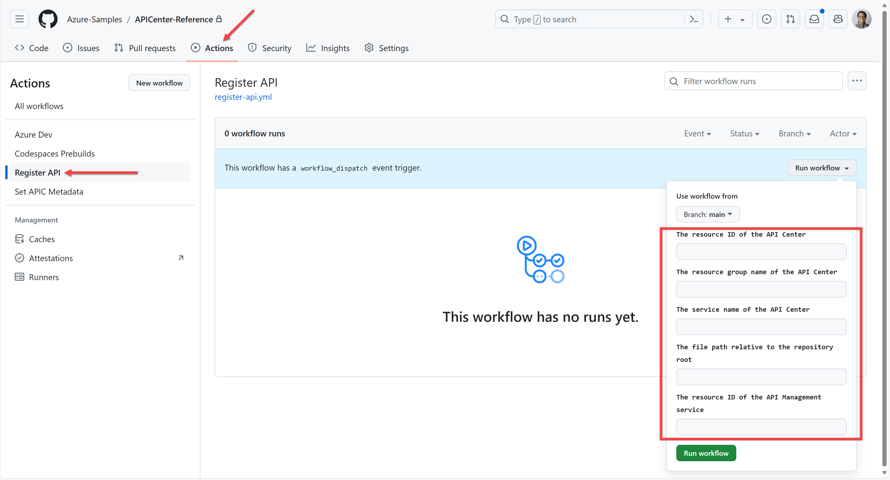

# API Center Reference

Throughout this reference sample, we'd like to give developer experiences how to use API Center (APIC) and seamless integration with API Management (APIM), as well as inner-loop development velocity increase.

- API Inventory
  - To Showcase API Management integration to quickly build API inventory from many API Management instances
  - To register APIs manually or through GitHub Actions workflow
- API Governance
  - To perform shift-left API governance functionality in VS Code
  - To run APIC Analyzer for server-side linting
  - To manage custom metadata
  - To handle events through Azure Event Grid and Logic Apps
- API Discovery and Consumption
  - To integrate the client SDK in .NET & JavaScript
  - To prepare the server app scaffolding in .NET and JavaScript
  - To manage API Center OSS portal

## Prerequisites

- Azure Subscription
- Visual Studio Code with API Center extension
- Azure Developer CLI
- Azure CLI with API Center extension
- GitHub CLI

## Getting Started

1. Fork this repository.
1. Clone the forked repository to your local machine.
1. Log in with the following command. Then, you will be able to use the `azd` cli to quickly provision and deploy the application.

    ```bash
    # Authenticate with Azure Developer CLI
    azd auth login
    
    # Authenticate with Azure CLI
    az login
    ```

1. Run `azd up` to provision all the resources to Azure and deploy the code to those resources.

    ```bash
    azd up
    ```

## APICenter Analyzer Integration (Optional)

APICenter Analyzer is a tool to lint API specifications on the server-side. If you want to integrate this server-side linting feature, you can install it by following steps.

1. In a separate directory, clone the APICenter Analyzer repository.

    ```bash
    azd init --template Azure/APICenter-Analyzer --branch preview
    ```

1. Provision resources to Azure and deploy the app.

    ```bash
    azd up
    ```

   > You will have to provide the API Center instance name and its resource group name for integration.

## CI/CD Pipelines

If you want to integrate the CI/CD pipeline with GitHub Actions, you can use the following command to create a GitHub repository and push the code to the repository.

1. First of all, log in to GitHub.

    ```bash
    # Authenticate with GitHub CLI
    gh auth login
    ```

1. Run the following commands to update your GitHub repository variables.

    ```bash
    # Bash
    AZURE_CLIENT_ID=$(./infra/scripts/get-azdvariable.sh --key AZURE_CLIENT_ID)
    azd pipeline config --principal-id $AZURE_CLIENT_ID
    
    # PowerShell
    $AZURE_CLIENT_ID = $(./infra/scripts/Get-AzdVariable.ps1 -Key AZURE_CLIENT_ID)
    azd pipeline config --principal-id $AZURE_CLIENT_ID
    ```

1. Now, you're good to go! Push the code to the GitHub repository or manually run the GitHub Actions workflow to get your portal deployed.

## API Registration

You can register APIs to API Center in various ways. But here, we will show you how to register APIs through Azure CLI and the GitHub Actions workflow.

### API Registration through Azure CLI

#### From local machine

You can register an API to API Center from a local machine, run the following commands:

```bash
# Bash
RESOURCE_GROUP=<RESOURCE_GROUP>
APIC_NAME=<API_CENTER_NAME>
API_DOC_FILE_PATH=<API_DOC_FILE_PATH>

az apic api register -g $RESOURCE_GROUP -s $APIC_NAME --api-location $API_DOC_FILE_PATH

# PowerShell
$RESOURCE_GROUP = "<RESOURCE_GROUP>"
$APIC_NAME = "<API_CENTER_NAME>"
$API_DOC_FILE_PATH = "<API_DOC_FILE_PATH>"

az apic api register -g $RESOURCE_GROUP -s $APIC_NAME --api-location $API_DOC_FILE_PATH
```

> **NOTE**: Replace `<RESOURCE_GROUP>`, `<API_CENTER_NAME>` and `<API_DOC_FILE_PATH>` with your values.

Alternatively, you can run the following script pre-written:

```bash
# Bash
RESOURCE_GROUP=<RESOURCE_GROUP>
API_DOC_FILE_PATH=<API_DOC_FILE_PATH>

RESOURCE_ID=$(az resource list --namespace "Microsoft.ApiCenter" --resource-type "services" -g $RESOURCE_GROUP --query "[].id" -o tsv)

./infra/scripts/new-apiregistration.sh --resource-id $RESOURCE_ID --file-location $API_DOC_FILE_PATH

# PowerShell
$RESOURCE_GROUP = "<RESOURCE_GROUP>"
$API_DOC_FILE_PATH = "<API_DOC_FILE_PATH>"

$RESOURCE_ID = $(az resource list --namespace "Microsoft.ApiCenter" --resource-type "services" -g $RESOURCE_GROUP --query "[].id" -o tsv)

./infra/scripts/New-ApiRegistration.ps1 -ResourceId $RESOURCE_ID -FileLocation $API_DOC_FILE_PATH
```

> **NOTE**: Replace `<RESOURCE_GROUP>`, `<API_CENTER_NAME>` and `<API_DOC_FILE_PATH>` with your values.

#### From API Management

You can also register APIs to API Center directly importing from API Management. Run the following commands:

```bash
# Bash
RESOURCE_GROUP=<RESOURCE_GROUP>
APIC_NAME=<API_CENTER_NAME>
APIM_ID=$(az resource list --namespace "Microsoft.ApiManagement" --resource-type "service" -g $RESOURCE_GROUP --query "[].id" -o tsv)

az apic service import-from-apim -g $RESOURCE_GROUP -s $APIC_NAME --source-resource-ids "$APIM_ID/apis/*"

# PowerShell
$RESOURCE_GROUP = "<RESOURCE_GROUP>"
$APIC_NAME = "<API_CENTER_NAME>"

$APIM_ID = az resource list --namespace "Microsoft.ApiManagement" --resource-type "service" -g $RESOURCE_GROUP --query "[].id" -o tsv

az apic service import-from-apim -g $RESOURCE_GROUP -s $APIC_NAME --source-resource-ids "$APIM_ID/apis/*"
```

> **NOTE**: Replace `<RESOURCE_GROUP>` and `<API_CENTER_NAME>` with your values.

Alternatively, you can run the following script pre-written:

```bash
# Bash
RESOURCE_GROUP=<RESOURCE_GROUP>

APIC_ID=$(az resource list --namespace "Microsoft.ApiCenter" --resource-type "services" -g $RESOURCE_GROUP --query "[].id" -o tsv)
APIM_ID=$(az resource list --namespace "Microsoft.ApiManagement" --resource-type "service" -g $RESOURCE_GROUP --query "[].id" -o tsv)

./infra/scripts/new-apiregistration.sh --resource-id $APIC_ID --api-management-id $APIM_ID

# PowerShell
$RESOURCE_GROUP = "<RESOURCE_GROUP>"

$APIC_ID = $(az resource list --namespace "Microsoft.ApiCenter" --resource-type "services" -g $RESOURCE_GROUP --query "[].id" -o tsv)
$APIM_ID = $(az resource list --namespace "Microsoft.ApiManagement" --resource-type "service" -g $RESOURCE_GROUP --query "[].id" -o tsv)

./infra/scripts/New-ApiRegistration.ps1 -ResourceId $APIC_ID -ApiManagementId $APIM_ID
```

> **NOTE**: Replace `<RESOURCE_GROUP>` with your values.

### API Registration through GitHub Actions Workflow

You can also register APIs through GitHub Actions workflow.



1. Click the `Actions` tab in your GitHub repository and select the `Register API` workflow.
1. Enter the information with following combinations:
   - API Center resource ID and file path
     - `The resource ID of the API Center`:

       👉 eg. `/subscriptions/<subscription_id>/resourceGroups/<resource_group>/providers/Microsoft.ApiCenter/services/<api_center_name>`
     - `The file path relative to the repository root`:

       👉 eg. `infra/apis/petstore.yaml`
   - API Center resource ID and API Management resource ID
     - `The resource ID of the API Center`:

       👉 eg. `/subscriptions/<subscription_id>/resourceGroups/<resource_group>/providers/Microsoft.ApiCenter/services/<api_center_name>`
     - `The resource ID of the API Management service`:

       👉 eg. `/subscriptions/<subscription_id>/resourceGroups/<resource_group>/providers/Microsoft.ApiManagement/service/<api_management_name>`
   - API Center resource group, name and file path
     - `The resource group name of the API Center`:

       👉 `<resource_group>`
     - `The service name of the API Center`:

       👉 `<api_center_name>`
     - `The file path relative to the repository root`:

       👉 eg. `infra/apis/petstore.yaml`
   - API Center resource group, name and API Management resource ID
     - `The resource group name of the API Center`:

       👉 `<resource_group>`
     - `The service name of the API Center`:

       👉 `<api_center_name>`
     - `The resource ID of the API Management service`:

       👉 eg. `/subscriptions/<subscription_id>/resourceGroups/<resource_group>/providers/Microsoft.ApiManagement/service/<api_management_name>`
1. Click the `Run workflow` button.
1. Check API Center to see if the API has been successfully registered.

## Custom Metadata Management

You can update custom metadata for APIs in various ways. But here, we will show you how to register APIs through Azure CLI and the GitHub Actions workflow.

### Custom Metadata Update through Azure CLI

You can update custom metadata value through Azure CLI. In this sample, we have the metadata of `compliance-reviewed` that accepts either `need-for-review` or `reviewed`. Run the following commands:

```bash
# Bash
RESOURCE_GROUP=<RESOURCE_GROUP>
APIC_NAME=<API_CENTER_NAME>
API_ID=<API_ID>
METADATA_KEY=compliance-reviewed
METADATA_VALUE=need-for-review

CUSTOM_PROPERTIES=$(echo "{\"$METADATA_KEY\":\"$METADATA_VALUE\"}" | jq -c .)

az apic api update  -g $RESOURCE_GROUP  -s $APIC_NAME --api-id $API_ID --custom-properties $CUSTOM_PROPERTIES

# PowerShell
$RESOURCE_GROUP = "<RESOURCE_GROUP>"
$APIC_NAME = "<API_CENTER_NAME>"
$API_ID = "<API_ID>"
$METADATA_KEY = "compliance-reviewed"
$METADATA_VALUE = "need-for-review"

$CUSTOM_PROPERTIES = @{ $METADATA_KEY = $METADATA_VALUE } | ConvertTo-Json -Compress | ConvertTo-Json

az apic api update  -g $RESOURCE_GROUP  -s $APIC_NAME --api-id $API_ID --custom-properties $CUSTOM_PROPERTIES
```

> **NOTE**: Replace `<RESOURCE_GROUP>`, `<API_CENTER_NAME>` and `API_ID` with your values.

Alternatively, you can run the following script pre-written:

```bash
# Bash
RESOURCE_GROUP=<RESOURCE_GROUP>
API_ID=<API_ID>
METADATA_KEY=compliance-reviewed
METADATA_VALUE=reviewed

RESOURCE_ID=$(az resource list --namespace "Microsoft.ApiCenter" --resource-type "services" -g $RESOURCE_GROUP --query "[].id" -o tsv)

./infra/scripts/set-apimetadata.sh --resource-id $RESOURCE_ID --api-id $API_ID --metadata-key $METADATA_KEY --metadata-value $METADATA_VALUE

# PowerShell
$RESOURCE_GROUP = "<RESOURCE_GROUP>"
$API_ID = "<API_ID>"
$METADATA_KEY = "compliance-reviewed"
$METADATA_VALUE = "reviewed"

$RESOURCE_ID = $(az resource list --namespace "Microsoft.ApiCenter" --resource-type "services" -g $RESOURCE_GROUP --query "[].id" -o tsv)

./infra/scripts/Set-ApiMetadata.ps1 -ResourceId $RESOURCE_ID -ApiId $API_ID -MetadataKey $METADATA_KEY -MetadataValue $METADATA_VALUE
```

> **NOTE**: Replace `<RESOURCE_GROUP>` and `<API_ID>` with your values.

### Custom Metadata Update through GitHub Actions Workflow

You can also update custom metadata through GitHub Actions workflow.


1. Click the `Actions` tab in your GitHub repository and select the `Set APIC Metadata` workflow.
1. Enter the information with following combinations:
   - API Center resource ID
     - `The resource ID of the API Center`:

       👉 eg. `/subscriptions/<subscription_id>/resourceGroups/<resource_group>/providers/Microsoft.ApiCenter/services/<api_center_name>`
     - `The API ID registered in the API Center`:

       👉 eg. `uspto-api`
     - `The key of the metadata to set`:

       👉 eg. `compliance-reviewed`
     - `The value of the metadata to set`:

       👉 eg. `need-for-review`
   - API Center resource group and name
     - `The resource group name of the API Center`:

       👉 `<resource_group>`
     - `The service name of the API Center`:

       👉 `<api_center_name>`
     - `The API ID registered in the API Center`:

       👉 eg. `uspto-api`
     - `The key of the metadata to set`:

       👉 eg. `compliance-reviewed`
     - `The value of the metadata to set`:

       👉 eg. `need-for-review`
1. Click the `Run workflow` button.
1. Check API Center to see if the custom metadata value has been successfully updated.

## API Center Analyzer

API specifications can be linted using the API Center Analyzer.

### Standalone Linting through Visual Studio Code

TBD

### Server-Side Linting through Azure Portal

TBD

## API Center Portal Integration (Optional)

TBD

## API Client SDK Integration

TBD

## Resources

- [API Center Documentation](https://aka.ms/apicenter)
- [API Center Analyzer](https://aka.ms/apicenter-analyzer)
- [API Center Portal](https://aka.ms/apicenter-portal)
