<!-- markdownlint-disable MD033 -->
# API Center Analyzer Integration

You can analyze your API documents using Visual Studio Code (Standalone) or Azure Portal (Server-Side). This section will guide you through the integration process.

## Standalone Analyzer through Visual Studio Code

> To use this standalone analyzer, you need to install the [API Center extension](https://marketplace.visualstudio.com/items?itemName=apidev.azure-api-center) in Visual Studio Code.

1. Run the sample app.

    ```bash
    # .NET
    dotnet watch run --project ./dotnet/src/ApiApp
    ```

   You'll see the following Swagger UI page.

   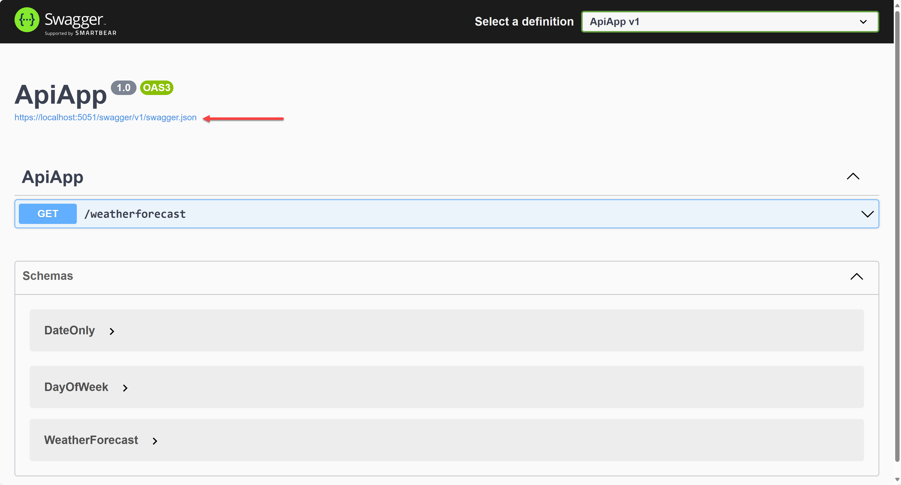

1. Click `https://localhost:5051/swagger/v1/swagger.json` to see the OpenAPI document.

   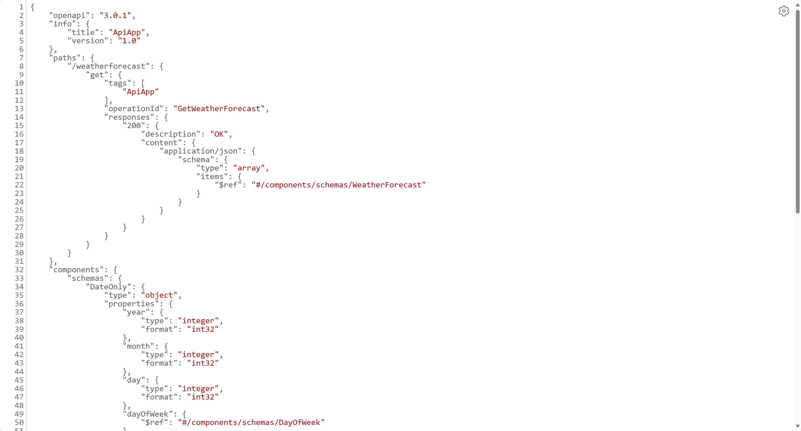

1. Save the OpenAPI document to `weatherforecast.json`.
1. Stop the sample app by pressing <kbd>Ctrl</kbd>+<kbd>C</kbd>.
1. Open `weatherforecast.json` in Visual Studio Code. You'll see many yellow lines and red lines

   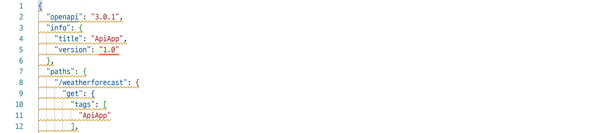

1. Type <kbd>F1</kbd> then select "Azure API Center: Set active API Style Guide".

   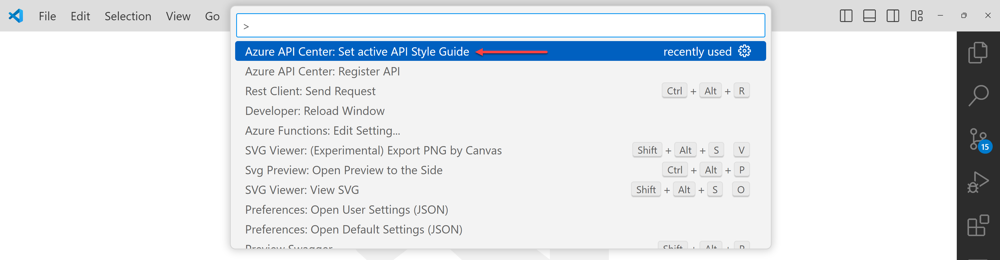

   You will have several options to choose the styles. Choose either `Microsoft Azure REST API` or `OWASP API Security Top 10` and see the analysis results.

   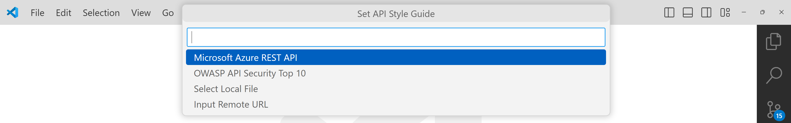

1. You can also choose the custom API style guide that reflects your organization's policies. This time choose `Select Local File` then select the `resources/rulesets/oas.yaml` file. You'll still see many yellow lines and red lines. Hover your mouse and see what needs to be fixed.

   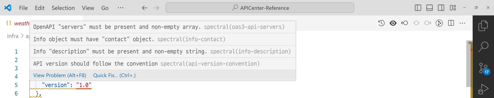

1. Open `dotnet/src/ApiApp/Program.cs` and find the line:

    ```csharp
    // Add services to the container.
    builder.Services.AddOpenApiService();
    //builder.Services.AddImprovedOpenApiService();
    ```

1. Comment out this line: `builder.Services.AddOpenApiService();`, and uncomment this line: `//builder.Services.AddImprovedOpenApiService();`.
1. Find the line:

    ```csharp
    // Add endpoint to the application.
    app.UseWeatherForecastEndpoint(summaries);
    //app.UseImprovedWeatherForecastEndpoint(summaries);
    ```

1. Comment out this line: `app.UseWeatherForecastEndpoint(summaries);`, and uncomment this line: `//app.UseImprovedWeatherForecastEndpoint(summaries);`.
1. Run the sample app again.

    ```bash
    # .NET
    dotnet watch run --project ./dotnet/src/ApiApp
    ```

   You'll see the following Swagger UI page.

   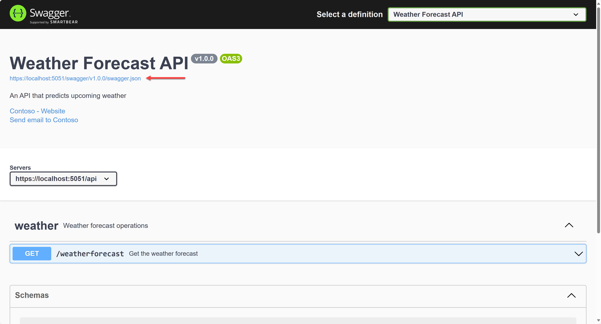

1. Click `https://localhost:5051/swagger/v1.0.0/swagger.json` to see the OpenAPI document.

   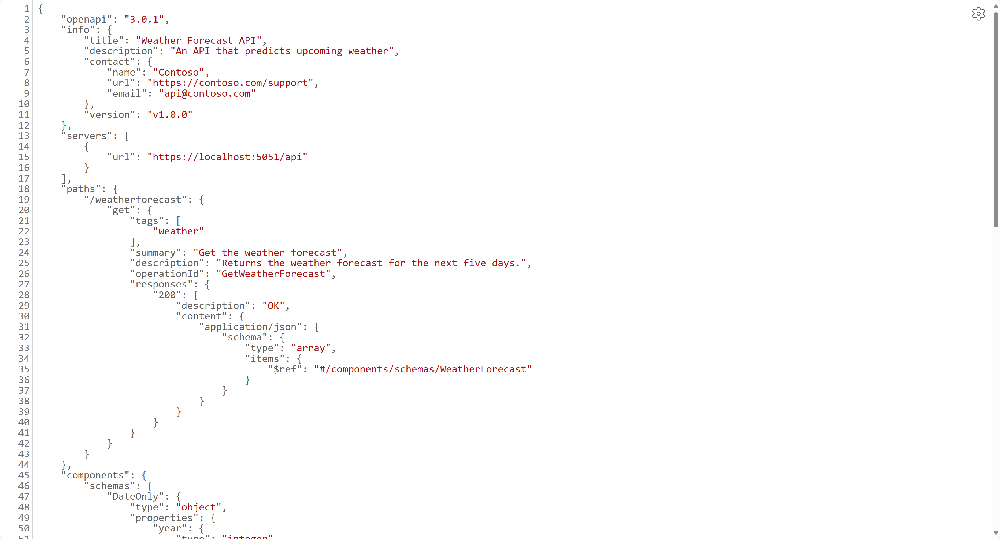

1. Save the OpenAPI document to `weatherforecast-reviewed.json`.
1. Stop the sample app by pressing <kbd>Ctrl</kbd>+<kbd>C</kbd>.
1. Open `weatherforecast-reviewed.json` in Visual Studio Code. You'll see all yellow lines and red lines disappeared.

   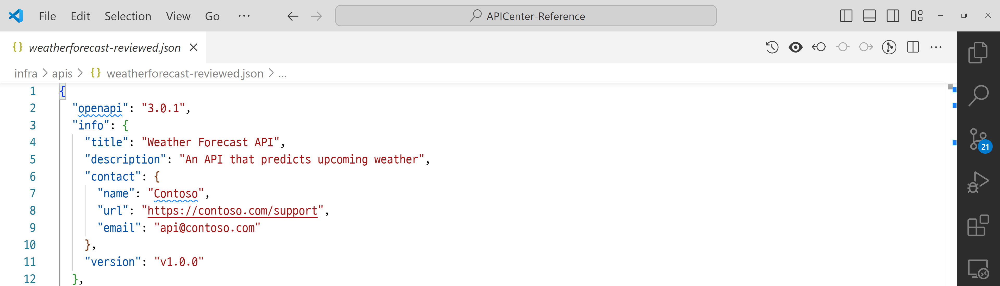

## Server-Side Analyzer through Azure Portal

To use this server-side analysis feature, you need to install the [APICenter Analyzer](https://github.com/Azure/APICenter-Analyzer) first.

### Install APICenter Analyzer

[APICenter Analyzer](https://github.com/Azure/APICenter-Analyzer) is a tool to analyze API specifications on the server-side. If you want to integrate this server-side analysis feature, you can install it by following steps.

1. In a separate directory, say `~/apic-analyzer`, clone the APICenter Analyzer repository.

    ```bash
    azd init --template Azure/APICenter-Analyzer --branch preview
    ```

   > You will be asked to provide the environment name. Give it a different name from the one holding the existing API Center.

1. Copy over the ruleset to the APICenter Analyzer repository.

    ```bash
    # Bash
    cp resources/rulesets/oas.yaml ~/apic-analyzer/resources/rulesets/

    # PowerShell
    Copy-Item -Path resources/rulesets/oas.yaml -Destination ~/apic-analyzer/resources/rulesets/
    ```

1. Provision resources to Azure and deploy the app.

    ```bash
    azd up
    ```

   > You will have to provide the existing API Center instance name and its resource group name for integration.

### Server-Side Analysis by Registering API

1. Register `weatherforecast.json` to API Center through Azure Portal or through this document, [API Registration](./api-registration.md).
1. Check the warnings and errors in the API Center.

   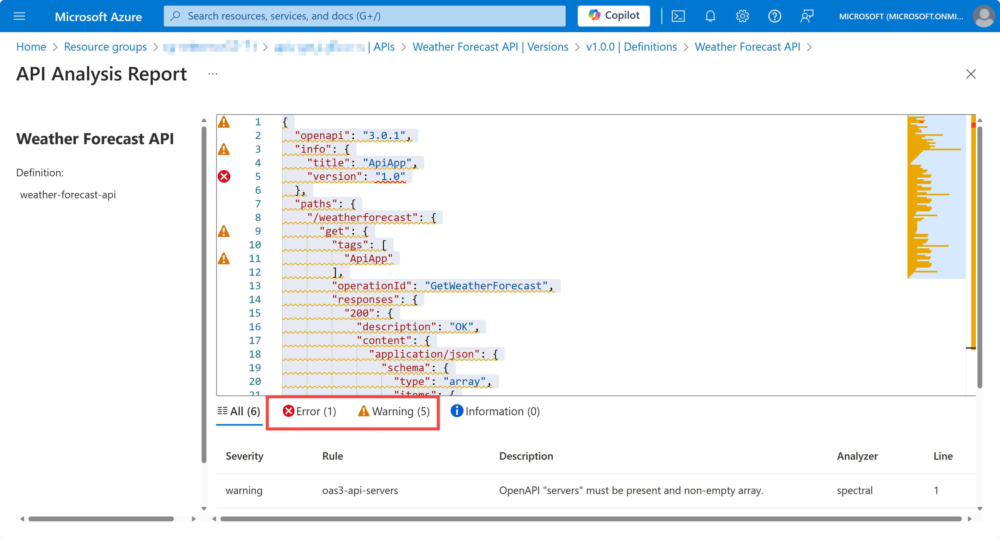

1. Update existing API definition with `weatherforecast-reviewed.json` to API Center through Azure Portal or through this document, [API Registration](./api-registration.md).
1. Check the warnings and errors in the API Center.

   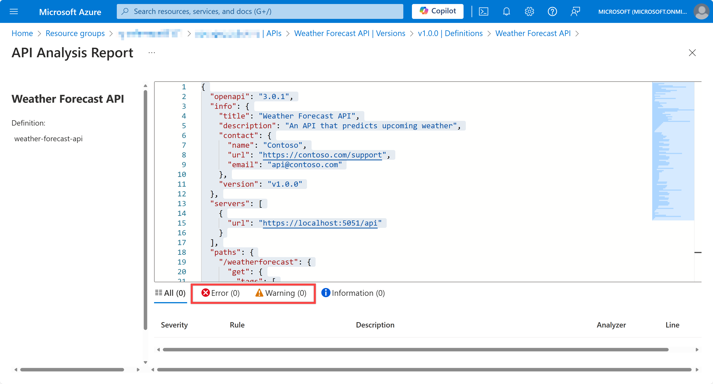
