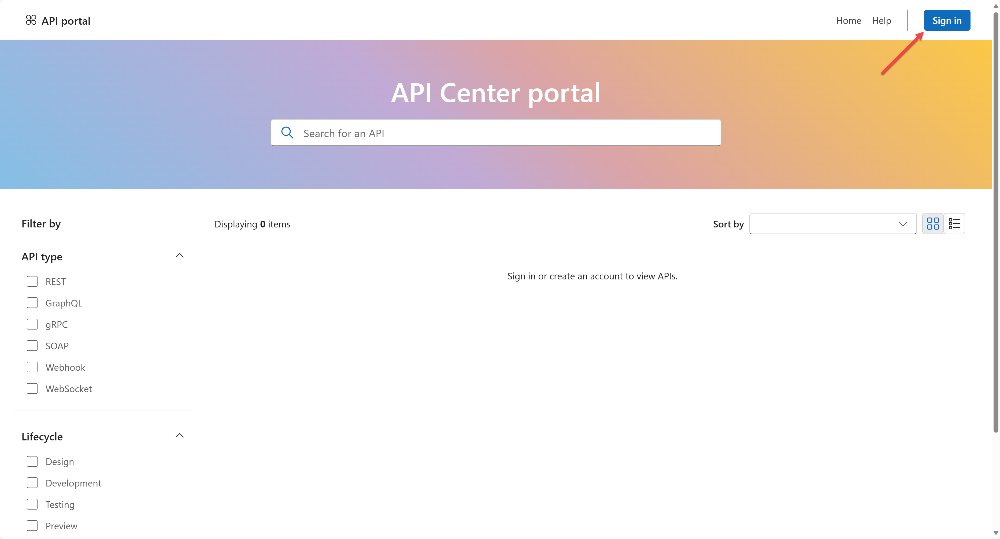
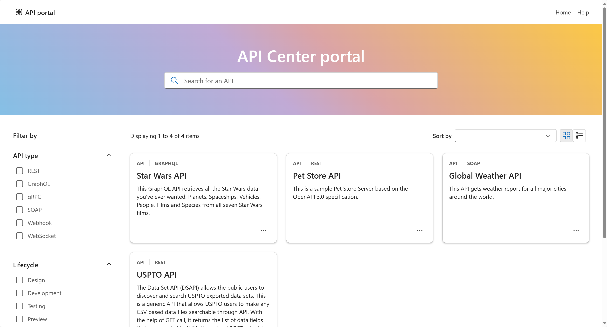

<!-- markdownlint-disable MD033 -->
# API Center Portal Integration

[API Center Portal](https://github.com/Azure/APICenter-Portal-Starter) is a self-host tool for developers and stakeholders in your organization to discover the APIs in your API Center. This section will guide you through the integration process.

1. In a separate directory, say `~/apic-portal`, clone the APICenter Portal repository.

    ```bash
    azd init --template Azure/APICenter-Portal-Starter --branch main
    ```

   > You will be asked to provide the environment name. Give it a different name from the one holding the existing API Center.

1. Provision resources to Azure and deploy the app.

    ```bash
    azd up
    ```

   > You will have to provide the existing API Center instance name and its resource group name for integration.

1. Once the deployment is completed, you'll be able to see the Azure Static Web App instance URL to access to the portal in the terminal. Open this URL on your web browser.

   

1. Login with your organization account. Then, you'll see all the APIs registered.

   
