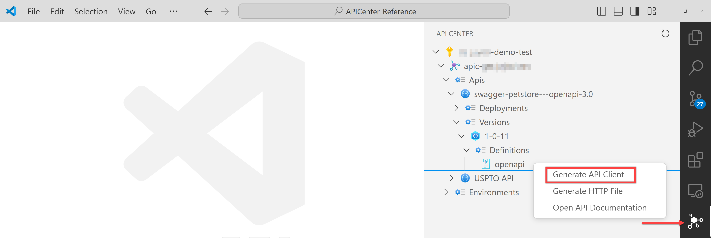
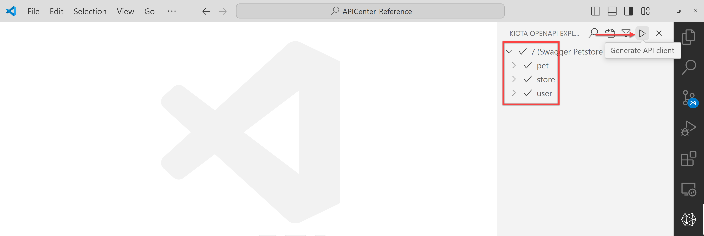
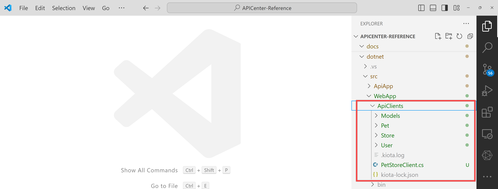
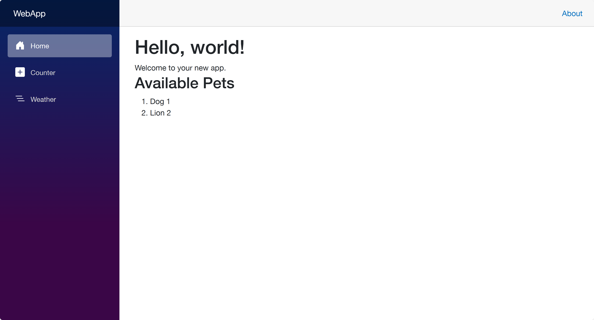

<!-- markdownlint-disable MD033 -->
# API Client SDK Integration

You can create a client SDK from APIs registered on API Center using Visual Studio Code. This section will guide you through the integration process.

> To use this feature, you need to install the [API Center extension](https://marketplace.visualstudio.com/items?itemName=apidev.azure-api-center) in Visual Studio Code. In addition to that, you may be asked to install the [Microsoft Kiota](https://marketplace.visualstudio.com/items?itemName=ms-graph.kiota) extension.

1. Open the API Center extension, navigate down to the API definition, and right-mouse click on the API definition. Then choose the "Generate API Client" option.

   

1. When the pop-up modal appears, click the "Open" button.

   

1. When the Kiota extension opens, make sure that everything is selected and click the ▶️ button to generate an API client.

   

1. The prompt asks several questions in the order. Enter the following values:
   1. Choose a name for the client class 👉 `PetStoreClient`
   1. Choose a name for the client class namespace 👉 `WebApp.ApiClients`
   1. Enter an output path relative to the root of the project 👉 `dotnet/src/WebApp/ApiClients`
   1. Pick a language 👉 `CSharp - stable`

1. After the client is generated, you can see the client class in the specified output path.

   

1. Copy some codes to make the client SDK work.

    ```bash
    # Bash
    ./infra/scripts/copy-files.sh
    
    # PowerShell
    ./infra/scripts/Copy-Files.ps1
    ```

1. Run the following command to run the web application.

```bash
dotnet watch run --project dotnet/src/WebApp
```

1. Open the browser and navigate to `https://localhost:5001`.
1. You can see the list of pets from the PetStore API.

   
