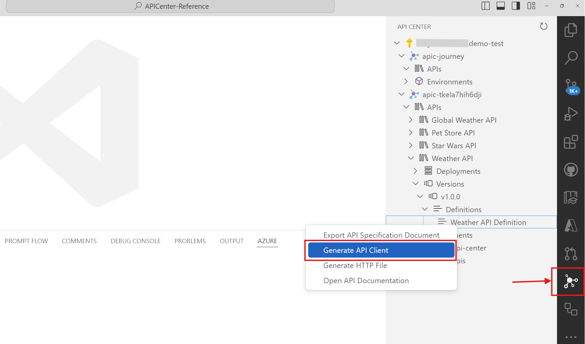
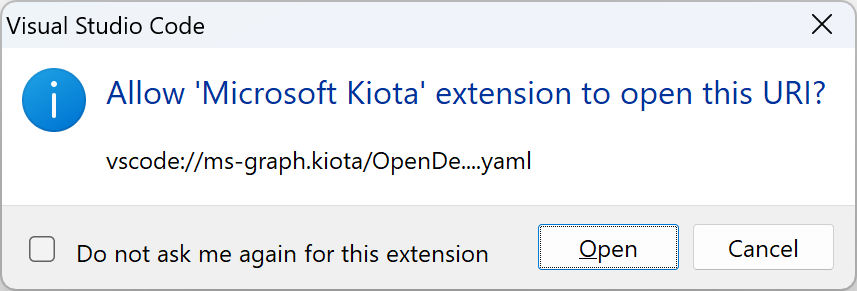
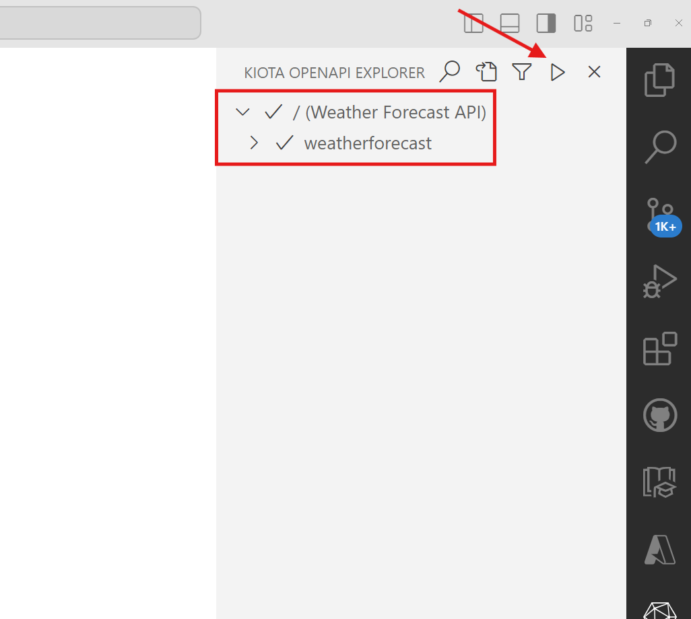
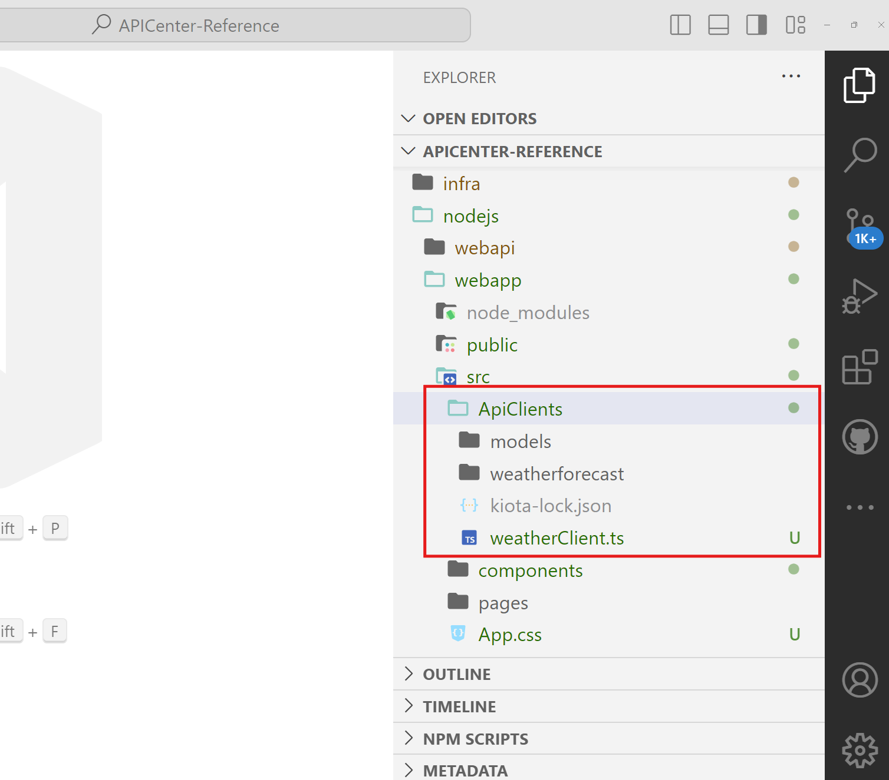
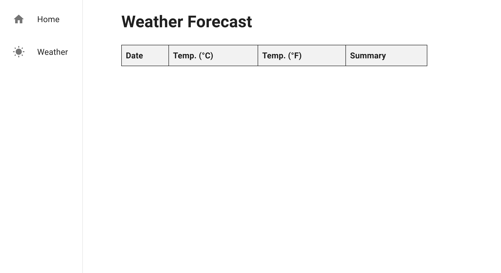
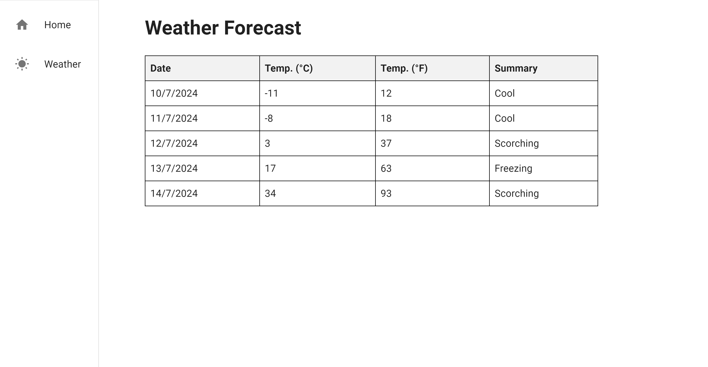

<!-- markdownlint-disable MD033 -->
# API Client SDK Integration

You can create a client SDK from APIs registered on API Center using Visual Studio Code. This section will guide you through the integration process.

> To use this feature, you need to install the [API Center extension](https://marketplace.visualstudio.com/items?itemName=apidev.azure-api-center) in Visual Studio Code. In addition to that, you may be asked to install the [Microsoft Kiota](https://marketplace.visualstudio.com/items?itemName=ms-graph.kiota) extension.

1. Open the API Center extension, navigate down to the API definition, and right-mouse click on the API definition. Then choose the "Generate API Client" option.

   

1. When the pop-up modal appears, click the "Open" button.

   

1. When the Kiota extension opens, make sure that everything is selected and click the ▶️ button to generate an API client.

   

1. The prompt asks several questions in the order. Enter the following values:
   1. Choose a name for the client class 👉 `WeatherClient`
   1. Choose a name for the client class namespace 👉 `WebApp.ApiClients`
   1. Enter an output path relative to the root of the project 👉 `nodejs/webapp/src/ApiClients`
   1. Pick a language 👉 `TypeScript - preview`

1. After the client is generated, you can see the client class in the specified output path.

   

## Run the WebApp

1. While in the root of the project, run the following command to install the required packages and run the web application.

    ```bash
    cd nodejs/webapp && npm install && npm start
    ```

1. On `localhost:3000`, you will see the following UI, but when you navigate to the Weather page, you only see an empty table with no weather data.

    

1. Let's make a small modification to the code to make the client SDK work. Open `src/components/WeatherList.js` and uncomment the following line

    ```bash
        <Box component="main" sx={{ flexGrow: 1, pl:30 }}>
            <h1>Weather Forecast</h1>
                {/* <WeatherList /> */}
        </Box>
    ```

1. Run the following command to run the web application.

```bash
cd nodejs/webapp & npm install
```

1. Open the browser and navigate to `https://localhost:3000`.
1. You can see a table with weather forecast data from the WeatherForecast API.

   
