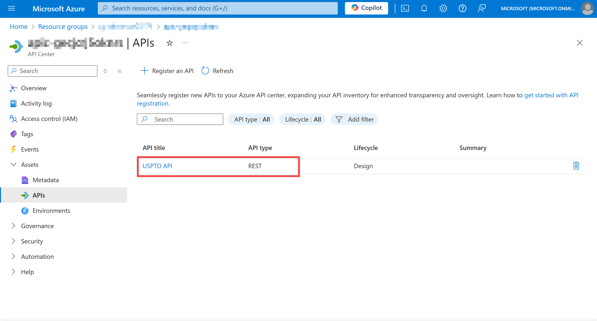
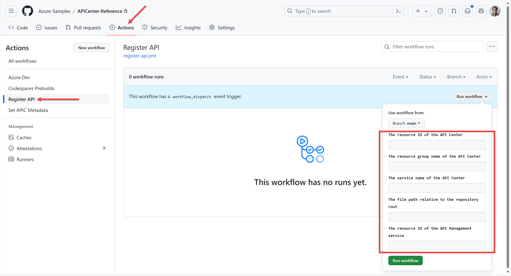

# API Registration

You can register APIs to API Center in various ways. But here, we will show you how to register APIs through Azure CLI and the GitHub Actions workflow.

## API Registration through Azure CLI

### From local machine

You can register an API to API Center from a local machine, run the following commands. Let's register the Pet Store API document.

```bash
# Bash
RESOURCE_GROUP=<RESOURCE_GROUP>
APIC_NAME=<API_CENTER_NAME>
API_DOC_FILE_PATH=infra/apis/petstore.yaml

az apic api register -g $RESOURCE_GROUP -s $APIC_NAME --api-location $API_DOC_FILE_PATH

# PowerShell
$RESOURCE_GROUP = "<RESOURCE_GROUP>"
$APIC_NAME = "<API_CENTER_NAME>"
$API_DOC_FILE_PATH = "infra/apis/petstore.yaml"

az apic api register -g $RESOURCE_GROUP -s $APIC_NAME --api-location $API_DOC_FILE_PATH
```

> **NOTE**: Replace `<RESOURCE_GROUP>` and `<API_CENTER_NAME>` with your values.

Alternatively, you can run the following script pre-written:

```bash
# Bash
RESOURCE_GROUP=<RESOURCE_GROUP>
API_DOC_FILE_PATH=infra/apis/petstore.yaml

RESOURCE_ID=$(az resource list --namespace "Microsoft.ApiCenter" --resource-type "services" -g $RESOURCE_GROUP --query "[].id" -o tsv)

./infra/scripts/new-apiregistration.sh --resource-id $RESOURCE_ID --file-location $API_DOC_FILE_PATH

# PowerShell
$RESOURCE_GROUP = "<RESOURCE_GROUP>"
$API_DOC_FILE_PATH = "infra/apis/petstore.yaml"

$RESOURCE_ID = $(az resource list --namespace "Microsoft.ApiCenter" --resource-type "services" -g $RESOURCE_GROUP --query "[].id" -o tsv)

./infra/scripts/New-ApiRegistration.ps1 -ResourceId $RESOURCE_ID -FileLocation $API_DOC_FILE_PATH
```

> **NOTE**: Replace `<RESOURCE_GROUP>`, `<API_CENTER_NAME>` and `<API_DOC_FILE_PATH>` with your values.

You will see the API registered in API Center.


### From API Management

You can also register APIs to API Center directly importing from API Management. Run the following commands:

```bash
# Bash
RESOURCE_GROUP=<RESOURCE_GROUP>
APIC_NAME=<API_CENTER_NAME>
APIM_ID=$(az resource list --namespace "Microsoft.ApiManagement" --resource-type "service" -g $RESOURCE_GROUP --query "[].id" -o tsv)

az apic service import-from-apim -g $RESOURCE_GROUP -s $APIC_NAME --source-resource-ids "$APIM_ID/apis/*"

# PowerShell
$RESOURCE_GROUP = "<RESOURCE_GROUP>"
$APIC_NAME = "<API_CENTER_NAME>"

$APIM_ID = az resource list --namespace "Microsoft.ApiManagement" --resource-type "service" -g $RESOURCE_GROUP --query "[].id" -o tsv

az apic service import-from-apim -g $RESOURCE_GROUP -s $APIC_NAME --source-resource-ids "$APIM_ID/apis/*"
```

> **NOTE**: Replace `<RESOURCE_GROUP>` and `<API_CENTER_NAME>` with your values.

Alternatively, you can run the following script pre-written:

```bash
# Bash
RESOURCE_GROUP=<RESOURCE_GROUP>

APIC_ID=$(az resource list --namespace "Microsoft.ApiCenter" --resource-type "services" -g $RESOURCE_GROUP --query "[].id" -o tsv)
APIM_ID=$(az resource list --namespace "Microsoft.ApiManagement" --resource-type "service" -g $RESOURCE_GROUP --query "[].id" -o tsv)

./infra/scripts/new-apiregistration.sh --resource-id $APIC_ID --api-management-id $APIM_ID

# PowerShell
$RESOURCE_GROUP = "<RESOURCE_GROUP>"

$APIC_ID = $(az resource list --namespace "Microsoft.ApiCenter" --resource-type "services" -g $RESOURCE_GROUP --query "[].id" -o tsv)
$APIM_ID = $(az resource list --namespace "Microsoft.ApiManagement" --resource-type "service" -g $RESOURCE_GROUP --query "[].id" -o tsv)

./infra/scripts/New-ApiRegistration.ps1 -ResourceId $APIC_ID -ApiManagementId $APIM_ID
```

> **NOTE**: Replace `<RESOURCE_GROUP>` with your values.

You will see the API registered to API Center from API Management.



## API Registration through GitHub Actions Workflow

You can also register APIs through GitHub Actions workflow.



1. Click the `Actions` tab in your GitHub repository and select the `Register API` workflow.
1. Enter the information with following combinations:
   - API Center resource ID and file path
     - `The resource ID of the API Center`:

       👉 eg. `/subscriptions/<subscription_id>/resourceGroups/<resource_group>/providers/Microsoft.ApiCenter/services/<api_center_name>`
     - `The file path relative to the repository root`:

       👉 eg. `infra/apis/petstore.yaml`
   - API Center resource ID and API Management resource ID
     - `The resource ID of the API Center`:

       👉 eg. `/subscriptions/<subscription_id>/resourceGroups/<resource_group>/providers/Microsoft.ApiCenter/services/<api_center_name>`
     - `The resource ID of the API Management service`:

       👉 eg. `/subscriptions/<subscription_id>/resourceGroups/<resource_group>/providers/Microsoft.ApiManagement/service/<api_management_name>`
   - API Center resource group, name and file path
     - `The resource group name of the API Center`:

       👉 `<resource_group>`
     - `The service name of the API Center`:

       👉 `<api_center_name>`
     - `The file path relative to the repository root`:

       👉 eg. `infra/apis/petstore.yaml`
   - API Center resource group, name and API Management resource ID
     - `The resource group name of the API Center`:

       👉 `<resource_group>`
     - `The service name of the API Center`:

       👉 `<api_center_name>`
     - `The resource ID of the API Management service`:

       👉 eg. `/subscriptions/<subscription_id>/resourceGroups/<resource_group>/providers/Microsoft.ApiManagement/service/<api_management_name>`
1. Click the `Run workflow` button.
1. Check API Center to see if the API has been successfully registered.
