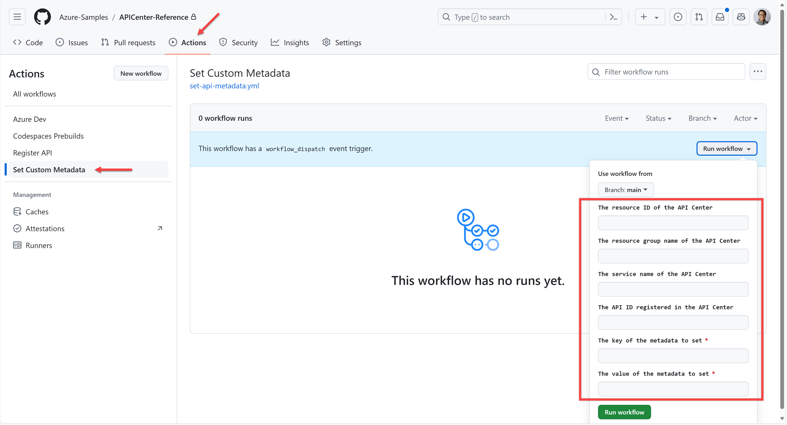

# Custom Metadata Management

You can update custom metadata for APIs in various ways. But here, we will show you how to register APIs through Azure CLI and the GitHub Actions workflow.

## Custom Metadata Update through Azure CLI

You can update custom metadata value through Azure CLI. In this sample, we have the metadata of `compliance-reviewed` that accepts either `need-for-review` or `reviewed`. Run the following commands:

```bash
# Bash
RESOURCE_GROUP=<RESOURCE_GROUP>
APIC_NAME=<API_CENTER_NAME>
API_ID=<API_ID>
METADATA_KEY=compliance-reviewed
METADATA_VALUE=need-for-review

CUSTOM_PROPERTIES=$(echo "{\"$METADATA_KEY\":\"$METADATA_VALUE\"}" | jq -c .)

az apic api update  -g $RESOURCE_GROUP  -s $APIC_NAME --api-id $API_ID --custom-properties $CUSTOM_PROPERTIES

# PowerShell
$RESOURCE_GROUP = "<RESOURCE_GROUP>"
$APIC_NAME = "<API_CENTER_NAME>"
$API_ID = "<API_ID>"
$METADATA_KEY = "compliance-reviewed"
$METADATA_VALUE = "need-for-review"

$CUSTOM_PROPERTIES = @{ $METADATA_KEY = $METADATA_VALUE } | ConvertTo-Json -Compress | ConvertTo-Json

az apic api update  -g $RESOURCE_GROUP  -s $APIC_NAME --api-id $API_ID --custom-properties $CUSTOM_PROPERTIES
```

> **NOTE**: Replace `<RESOURCE_GROUP>`, `<API_CENTER_NAME>` and `API_ID` with your values.

Alternatively, you can run the following script pre-written:

```bash
# Bash
RESOURCE_GROUP=<RESOURCE_GROUP>
API_ID=<API_ID>
METADATA_KEY=compliance-reviewed
METADATA_VALUE=reviewed

RESOURCE_ID=$(az resource list --namespace "Microsoft.ApiCenter" --resource-type "services" -g $RESOURCE_GROUP --query "[].id" -o tsv)

./infra/scripts/set-apimetadata.sh --resource-id $RESOURCE_ID --api-id $API_ID --metadata-key $METADATA_KEY --metadata-value $METADATA_VALUE

# PowerShell
$RESOURCE_GROUP = "<RESOURCE_GROUP>"
$API_ID = "<API_ID>"
$METADATA_KEY = "compliance-reviewed"
$METADATA_VALUE = "reviewed"

$RESOURCE_ID = $(az resource list --namespace "Microsoft.ApiCenter" --resource-type "services" -g $RESOURCE_GROUP --query "[].id" -o tsv)

./infra/scripts/Set-ApiMetadata.ps1 -ResourceId $RESOURCE_ID -ApiId $API_ID -MetadataKey $METADATA_KEY -MetadataValue $METADATA_VALUE
```

> **NOTE**: Replace `<RESOURCE_GROUP>` and `<API_ID>` with your values.

## Custom Metadata Update through GitHub Actions Workflow

You can also update custom metadata through GitHub Actions workflow.



1. Click the `Actions` tab in your GitHub repository and select the `Set APIC Metadata` workflow.
1. Enter the information with following combinations:
   - API Center resource ID
     - `The resource ID of the API Center`:

       👉 eg. `/subscriptions/<subscription_id>/resourceGroups/<resource_group>/providers/Microsoft.ApiCenter/services/<api_center_name>`
     - `The API ID registered in the API Center`:

       👉 eg. `uspto-api`
     - `The key of the metadata to set`:

       👉 eg. `compliance-reviewed`
     - `The value of the metadata to set`:

       👉 eg. `need-for-review`
   - API Center resource group and name
     - `The resource group name of the API Center`:

       👉 `<resource_group>`
     - `The service name of the API Center`:

       👉 `<api_center_name>`
     - `The API ID registered in the API Center`:

       👉 eg. `uspto-api`
     - `The key of the metadata to set`:

       👉 eg. `compliance-reviewed`
     - `The value of the metadata to set`:

       👉 eg. `need-for-review`
1. Click the `Run workflow` button.
1. Check API Center to see if the custom metadata value has been successfully updated.
